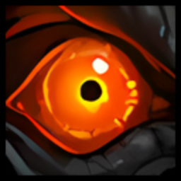

# GSE: Tracker

**Action Tracker &nbsp;·&nbsp; Player Tracker &nbsp;·&nbsp; Assisted Highlight &nbsp;·&nbsp; Meters**

 

A clean, highly-customizable combat overlay for sequence &amp; macro users — **sequence tracking**, an **assisted-rotation highlight**, a **player marker**, and a **full built-in meters suite**, all in one addon.

Integrates natively with **[GSE](https://www.curseforge.com/wow/addons/gse-gnome-sequencer-enhanced-advanced-macros)** when available, and also works with **Single-Button Assistant** and plain **manual keypresses**.

---

> [!CAUTION]
> **CLEAN INSTALL RECOMMENDED**
>
> After a major version update, a clean reinstall avoids broken settings, misplaced UI elements, or stale data.
> Remove the previous **GSE: Tracker** folder before installing, and reset saved variables for the cleanest setup.

---

## Overview

**GSE: Tracker** gives you a cleaner, more customizable way to see what your macros are doing in combat — then adds the awareness tools you'd otherwise need three separate addons for. Everything is configurable from one settings window with **live previews**.

> **Access:** type `/gsetracker` or click the **minimap button**.

---

## Core Features

### Action Tracker

Tracks the spells your sequence/macro fires and shows them as a clean, fully-configurable row of icons.

| Option | Description |
|--------|-------------|
| **Independent elements** | The **Sequence / Macro / Spell** name, **modifier keys**, and **keybind** text can each be toggled, resized, and repositioned on their own |
| **Free movement** | Drag any element anywhere, or set precise **X / Y** values |
| **Layouts** | Horizontal or vertical, with adjustable icon count, spacing, and scroll direction |
| **Live preview** | See every change instantly while you configure |

### Input &amp; Sequence Awareness

- **Pressed Indicator** — a customizable shape (crosshairs, dots, faction icons, or your own image) that **pulses in sync with how fast you're pressing**, so your input cadence is visible at a glance. Choose **None** to hide it.
- **Modifier tracking** — shows which modifier keys (Shift / Ctrl / Alt, side-aware) you're holding.
- **ModKey burst stack** — abilities fired while holding Ctrl/Alt stack into a centered combo display.
- **Keybind display** — optionally shows the key bound to the active sequence.

### Assisted Highlight

A flexible rotation-assist highlight that mirrors your suggested next ability **wherever you want it** — anchored to the **screen**, following the **mouse cursor**, or shown over the **target's portrait** (auto-sized and rounded to match). Optional **keybind + stack/charge count**, **range checking** (red-tints when out of range), and a **GCD swipe**.

### Player Tracker

A clear **combat marker** you can place on screen to instantly find your character during busy, movement-heavy encounters — with selectable symbols, size, color (incl. class color), and show-when rules.

### Built-in Meters Suite

A self-contained damage/utility meter set — no second meters addon required.

| Meter | What it shows |
|-------|---------------|
| **Details window** | **Damage / Healing / Dispels / Interrupts** tabs, expandable pet &amp; spell grouping |
| **Combat-session paging** | Step back through your **last 10 fights** with the title-bar arrows |
| **Live readouts** | Lightweight **DPS**, **HPS**, **GCD**, and assist-usage values |
| **Combat timer** | Docked fight timer |

---

## Looks Like *Your* UI

The tracker **adopts your action-bar skin automatically** — borders, masks, and fonts are pulled **live** from your skinner, so it never looks bolted-on:

---

## Customization &amp; Quality of Life

| Feature | Description |
|---|---|
| **Settings window** | One configuration window with **live previews** |
| **Fonts** | Independent fonts for Sequence, Modifier, and Keybind text — **LibSharedMedia** supported |
| **Icon borders** | Adjustable borders across the Action Tracker, Player Tracker, and Assisted Highlight |
| **Performance mode** | Drops visual effects &amp; animations for maximum FPS |
| **QoL extras** | Mute spell-fizzle sounds, hide red error text, account-wide or per-character settings |

---

## Tracker Options

> **Access:** `/gsetracker` &nbsp;·&nbsp; **minimap button**

| Option Group | Description |
|---|---|
| **Action Tracker** | Full layout and visual control |
| **Player Tracker** | Combat marker settings |
| **Assisted Highlight** | Highlight mode and target settings |
| **Meters** | Details window, DPS/HPS/GCD readouts, combat timer |
| **Fonts** | Sequence, Modifier, and Keybind fonts _(SharedMedia supported)_ |

---

## Compatibility

Built for current **Retail** with cross-version-safe APIs. Works **with or without GSE** installed.

---

## Feedback, Suggestions &amp; Bug Reports

Have **ideas, feedback, or a bug to report?** Join the **[Discord](https://discord.gg/gseunited)** — it's the best place for clear communication, issue tracking, and sharing ideas.

---

## Support the Project

If you enjoy **GSE: Tracker** and want to support ongoing development:

